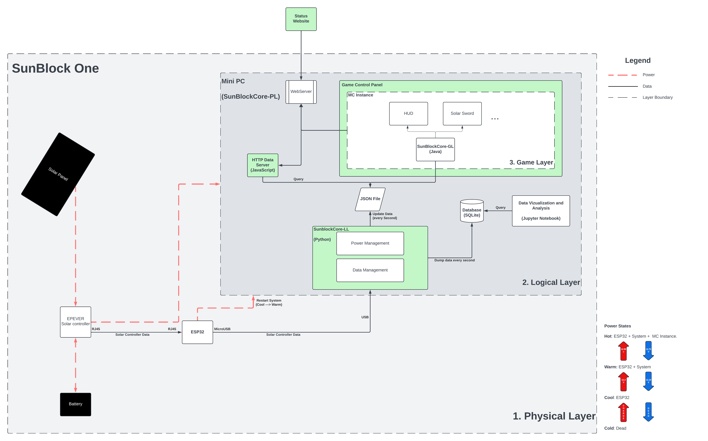

# SunBlock 

SunBlock is a solar-powered Minecraft server at the Milieux Institute, Concordia University, Montreal, Canada. 

The goal of our project is to blend the actual material conditions of gameplay (the computer hardware, networking, and energy infrastructure) with the production of the gameworld itself. Rather than just playing a game with thematics or a message around energy transition, we are endeavoring to provide a direct, tangible, and playable experience of the energy infrastructures which make that experience possible.
For more on the project checkout [main project website](https://minecraftbloc.milieux.ca/sunblock/)

For information on how to build a sunblock, checkout [this guide here](./BuildGuide.md).

---
SunBlock has quite a few moving parts, and for the sake of sanity, I find it useful to view the system in three layers. 

These are:
1. Physical Layer (PL)
2. Logical Layer (LL)
3. Game Layer (GL)

The three layers are related in this manner: 

Every layer has a core that is called SunBlockCore (creative, I know). For the game layer, this is the [Java mod](https://github.com/MC-Bloc/SunBlockCore-GL). For the logical layer, this is [a python script](https://github.com/MC-Bloc/SunBlockCore-LL) that manages things like power profiles, data logging, etc. On the physical layer, the SunBlockCore is [the server](#SunBlockCore-PL) itself, that powers the whole SunBlock system.  

## Game Layer (GL)
SunBlock runs Forge Minecraft `1.20.1`. 
While you can run a plain Java instance of Minecraft and have it start on boot, we run Minecraft through a [CubeCoders AMP](https://cubecoders.com/AMP) instance. Everything that happens inside Minecraft happens on the game layer. This includes the SunBlockCore Mod, Gaia's Riddle ModPack, and other mods. 

## Logical Layer (LL)
Everything inside the Server computer is part of the logical layer. 

An arduino script interfaces with the microcontroller. 

And a python script interfaces with the arduino scripts results, collecting all data in a simple SQLite database, while also putting instantaneous data in a JSON file.

The Python script also deals with the power profiles daemon and switches between `performance` and `power-saver` profiles which depends on the `intel_pstate` drivers. This is also part of game mechanics 

## Physical Layer (PL)
The physical layer comprises of:
1. The Solar Panel
2. The Solar Controller
3. The Battery
4. The ESP32 Microcontroller
5. The Server computer (i.e. SunBlockCore-PL) 

The Solar controller is connected to the Solar Panel, the battery, the server computer, and the microcontroller. Readings from the solar controller are measured by this microcontroller and sent to the server computer via a micro USB cable.   

### The Battery 
Throughout the project we have only used 12V LiFePO4 Sealed batteries. We first started with an 18Ah (216Wh) battery but because it got damaged we were not getting full charge capacities. We next went to a 20Ah (240Wh) battery which lasted us less than 24 hours. Next we went to a 50Ah (600Wh) battery which gave us much better performance but we still havent gotten the desired balance so next we will be going to 100Ah (1200Wh).

### The Solar Panel 
* ECOWORTHY ECOM-100
* [Details here](https://ca.eco-worthy.com/products/100w-12v-monocrystalline-solar-panel?gad_source=1&gclid=Cj0KCQjw2PSvBhDjARIsAKc2cgO-MuBKQ9RQny90ADCxcD9nJG9Rd4wowOLRUn5X54ssqMXJwJKo1DkaAj3pEALw_wcB)

### The Solar Controller 
* EPEVER MPPT Solar Charge Controller
* 30A
* [Manual here](https://www.epever.com/upload/cert/file/1811/Tracer-AN-SMS-EL-V1.0.pdf)

For the solar controller, sometimes you need to tweak the controller parameters. We connect the controller via RS45 cable to a windows and used EPEVER provided software. [Find this here](https://www.epever.com/support/softwares/?_gl=1*1nqa40u*_up*MQ..*_gs*MQ..&gclid=EAIaIQobChMI5bjtu4XoigMVek7_AR0PKRM7EAAYASAAEgKcTPD_BwE)

### SunBlockCore-PL 

#### SunBlock One (SB1) 
* Intel Core(TM) i7-1065G7 (4C\8T)
* 32GB RAM
* 1TB Crucial NVMe SSD  
* Running Ubuntu 22.04 (Desktop) LTS Jammy Jellyfish

#### SunBlock Two (SB2)
This is an [ODroid H4 Plus](https://www.hardkernel.com/shop/odroid-h4-plus/) system with Ubuntu 24.04 (Server). 

* 48GB DDR5 RAM
* 1TB NVMe SSD
* Processor N97.
* Ubuntu 24.04 (Server) 

### The Microcontroller 
Thats just an ESP32. We use this to read data from the solar controller. This controller can be powered by both: The Solar controller via an ethernet port and the PC via USB. 

## People

1. Bart Simon 
2. Rosie MacDonald
3. Quinn Saggio
4. Shahrom Ali
5. Stuart Thiel
6. Andrew
7. Angelica Calcagnile
8. Ella Noyes
9. Mario Gaudio 
10. Don Undeen
11. Darren Wershler 

